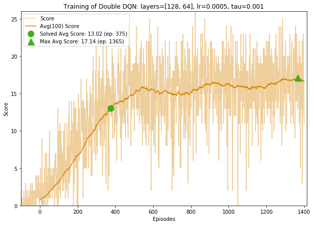
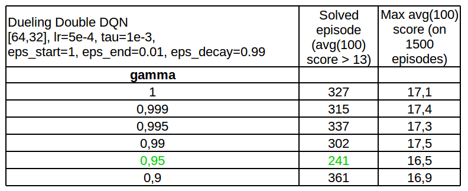

# Report Deep RL Project: Navigation
## 1. Introduction
To solve the Banana environment, I trained several kinds of agent by implementing the following algorithms:
* Deep Q learning (DQN)
* Double DQN
* Dueling DQN

I have also studied the effect of changing the values of some hyperparameters.

The best agent I have trained with the code of this repository is a Dueling Double DQN and it solved the environment in **233 episodes**. 


## 2. Learning algorithms
### 2.1. Deep Q-learning
Reference : [DQN paper](https://storage.googleapis.com/deepmind-media/dqn/DQNNaturePaper.pdf)


The main idea of DQN is to approximate the action-value function Q by a deep neural net.
Like in the paper, to preserve stability, the algorithm uses a replay buffer D, and a fixed target network Q^ (a second network that is updated less often then the main neural network Q).


The neural network is composed of n fully-connected layers. In all my tests, I have only used 2 layers, but with various dimensions([128,64], [64,32], [32,16]).


Hyperparameters (in bold, the parameters studied in the comparative tests below): 
* **gamma**, discount factor gamma,
* eps_start, starting value of epsilon (fixed to 1.0),
* **eps_end**, minimum value of epsilon,
* **eps_decay**, multiplicative factor (per episode) for decreasing epsilon,
* **tau**, the interpolation parameter when updating the target network  θ_target = tau * θ_local + (1 - tau)* θ_target,
* the replay buffer size (fixed to 1e5),
* the batch size (fixed to 64),
* the **learning rate lr** for the optimizer (Adam).

### 2.2. Double DQN
Reference: [Double DQN paper](https://arxiv.org/abs/1509.06461)

The Double DQN helps to prevent the overestimation of the Q-values in a DQN, by using the current network Q to select the best action and the targe netwotk Q^ to evaluate that action, when estimating the TD target whereas in classic DQN, only Q^ is used to estimate the TD target).

### 2.3. Dueling DQN
Reference: [Dueling DQN paper](https://arxiv.org/abs/1511.06581)

The main idea of a dueling DQN is to decompose *Q(s,a)* into the state value *V(s)* and the avantage *A(s,a)*, which measures how much better is to take action *a* versus all other possible actions at state *s*. A benefit of this decoupling is that the agent can learn which states are (or are not) valuable **without** having to learn the effect of each action at each state.

The architecture is different from the simple DQN.


## 3. Comparative tests

I have trained many agents with different architectures and with various hyperparameters in order to compare them (see [training.ipynb](training.ipynb)). 

For each configuration tested, I have trained the agent during 1500 episodes, plotted the scores and the moving average of the scores over 100 episodes, and noted down the number of episodes needed to solve the environment and the max of the moving average. 

### 3.1 Comparing the agent type

Results for DQN, Double DQN, Dueling DQN and Dueling Double DQN with same values of hyperparameters (lr=5e-4, tau=1e-3, eps_end=0.01,eps_decay=0.995, gamma=0.99). For each agent type, 3 instances have been trained. In the table below, "Solved episode" is the mean for the 3 instances, "Max avg(100) score" is the max over the 3 instances.


Below, the scores of one instance for each agent type has been ploted.

||||
|---|---|---|
||||
||||
||||


**Observations:**
- Whatever the agent type and the dimensions of the fully connected layers, the plots of the moving average of the scores have a similar shape : a nice regular slope from 0 to 13, then a clear slow down on the velocity and difficulty to get higher than 17.
- Even after a lot of trining, there are some episodes with very low scores. By watching an agent playing, it appears that the agent sometimes enters a loop (s1,a1,s2,a2,s1,a1,s2,a2,s1,...) and stays stuck until the end of the episode without improving the score.
- That does not explicitly appears in the table above, but the detailled results in [training.ipynb](training.ipynb) show that the variability of the solved score for one given agent type is significant (around 10%-15%). For example, the solved score of 3 instances of Dueling Double DQN [128,64]: 379,384 and 429.
- Following the previous observation, it is not really possible to decide if the size of the fully connected layers gives better (or worse) results, and which type of agent is better than another one.

For the following tests where I play with the hyperparameters, I use Dueling Double DQNs [64,32].

### 3.2 Influence of the learning rate


**Observations:**
- Training an agent with a large learning rate does not give good results.

### 3.3 Influence of tau


**Observations:**
- tau = 1e-3 gives better results.

### 3.4 Influence of eps_decay


**Observations:**
- eps_decay = 0.99 gives better results.

### 3.5 Influence of eps_end


**Observations:**
- It is difficult to decide a better value for eps_end.

### 3.6 Influence of gamma




**Observations:**
- gamma = 0.95 gives better results.

### 3.7 Best hyperparameters ?
From the results above, for each hyperparameters, I kept the value which gave the best solved score, and trained a few agents.
```
Dueling Double DQN
hidden_layers: [64,32] 
lr: 5e-4
tau: 1e-3
gamma: 0.95
eps_start: 1.0 
eps_end: 0.005 
eps_decay: 0.99
```
With these values, the enviroment could be **solved in 233 episodes.**


## 4. Ideas for future work
- Try other extensions to the DQN algorithm like Prioritized Experience Replay, or even better Rainbow, which incorporates 3 more extensions to Double DQN, Dueling and Prioritized Experience Replay.
- Try to train an agent from raw pixels.tra