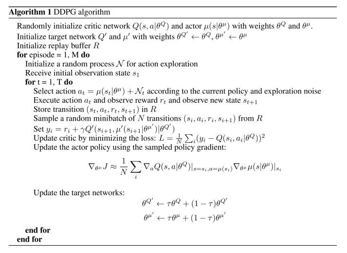
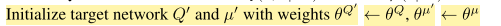
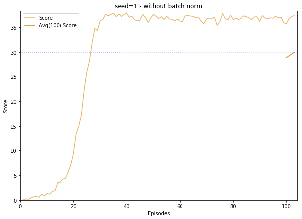
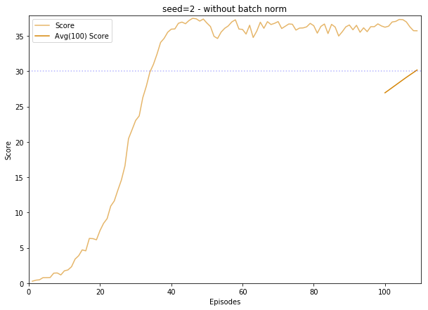
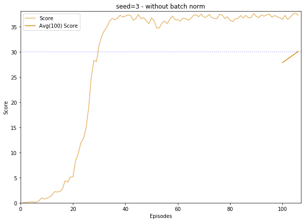
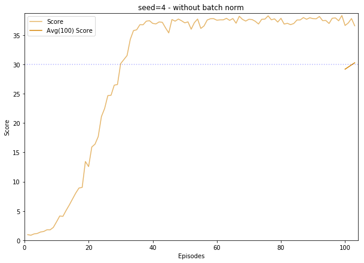

# Report Deep RL Project: Continuous Control on Reacher environment

## 1. Learning algorithm

The learning algorithm used to solve the Reacher environment is **Deep Deterministic Policy Gradients (DDPG)** as described in the reference paper [Continuous control with deep reinforcement learning](https://arxiv.org/abs/1509.02971) (Lillicrap &Hunt, 2016). 

DDPG is an actor-critic, model-free algorithm based on the deterministic policy gradient that can operate over continuous action spaces, and robustly solve many simulated physics tasks.

The code to implement DDPG is based on the version of the [BipedalWalker environment](https://github.com/udacity/deep-reinforcement-learning/tree/master/ddpg-bipedal) from the Udacity Deep Reinforcement Learning github. The Udacity code has been modified to:
- do **distributed training**: the Unity environment contains 20 identical agents, each agent with its own copy of the environment and participating to the task of gathering experience.
- **initialize the target networks** (actor and critic) with the same weights as the learning networks:

## 2. Experiment details

The **Actor network**, which maps *state* to *action values*, has **2 hidden fully connected layers with 128 units each**, and a final ouput layer that yields 4 action values with *tanh* activation.
The **Critic network**, which approximates the value function Q, has also **2 hidden fully connected layers with 128 units each**. The state vector constitutes the input of the first layer, while actions are introduced in the 2nd hidden layer.
Both neural networks use the rectified non-linearity **Relu** for all hidden layers.

Like in the reference paper, the final layer weights and biases of both the actor and critic are initialized from a uniform distribution [−3×10−3, 3×10−3]. The other layers are initialized from uniform distributions [− 1/√f , 1/√f ] where f is the fan-in of the layer.

For exploration, noise is produced with an **Ornstein-Uhlenbeck process** (Uhlenbeck &Ornstein, 1930) with θ = 0.15 and σ = 0.2 (same value as in the paper).

The **replay buffer size** is 1e5 (vs 1e6 in the paper).

The **minibatch size** is 128 (vs 64).

The optimizer is Adam. The **learning rate** is 1e-3 for the Actor (vs 1e-4), 5e-4 for the Critic (vs 1e-3). For the Critic, the **weight decay** is set to 0 (vs 1e-2).

The **discount factor γ** is 0.99 (as in the paper).

For the **soft target updates**, τ = 0.001 (as in the paper).

## 3. Plot of rewards

With the hyperparameters set as above, 4 instances were trained with different random seeds, with similar results.
Between 2 and 10 episodes (+100) needed to solve the environment.

Below, the scores of the instances have been ploted.

|||
|---|---|
|Solved in 10 episodes|Solved in 5 episodes||
|Solved in 9 episodes|Solved in 2 episodes|
|||

## 4. Ideas for future work
For this environment (Reacher), I don't see much place for learning speed improvement, since  the results are already pretty good. I have tried to include batch normalization as explained in the research paper, but get the same kind of results.

My plan is to try DDPG on a more complex environment like Crawler, where a discriminative analysis could be useful to evaluate the impact of changes in the model or in the hyperparameters.
