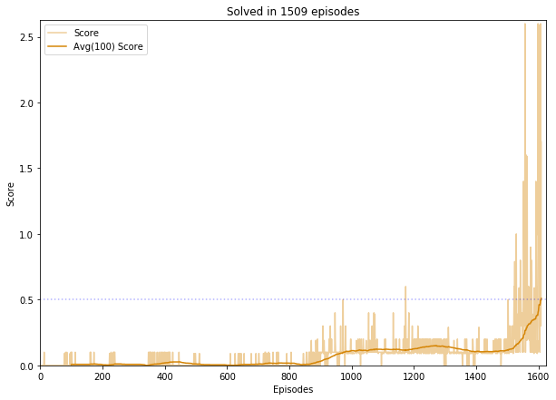
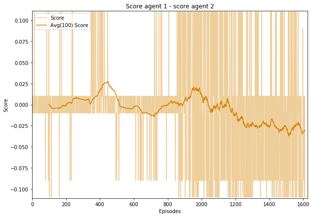
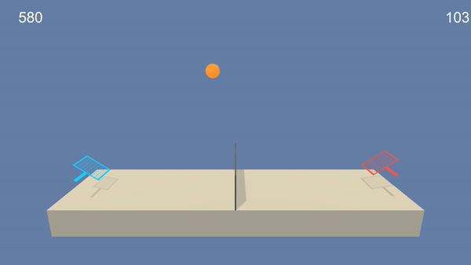
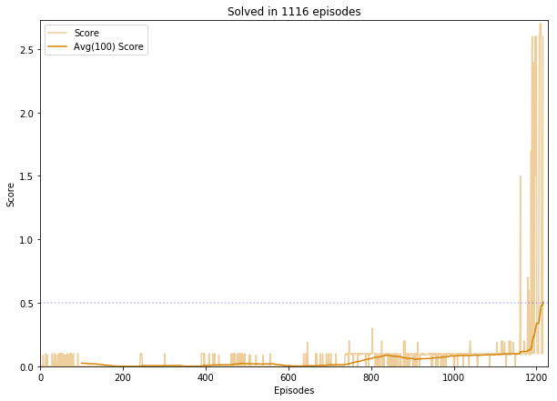
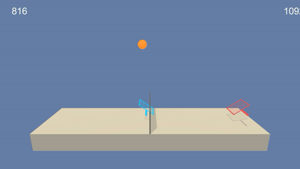
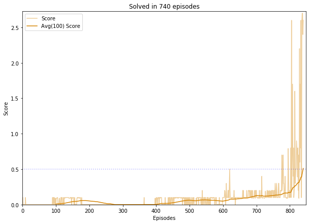
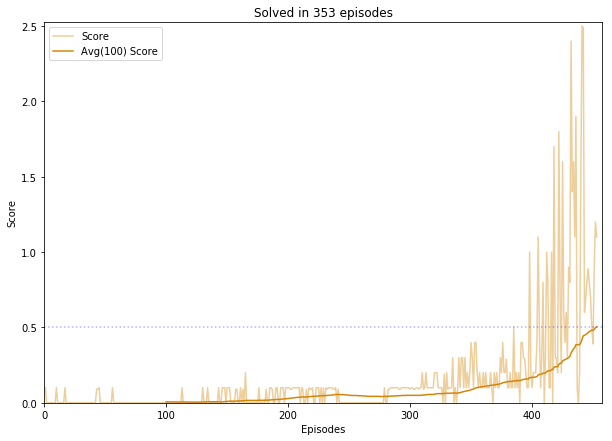
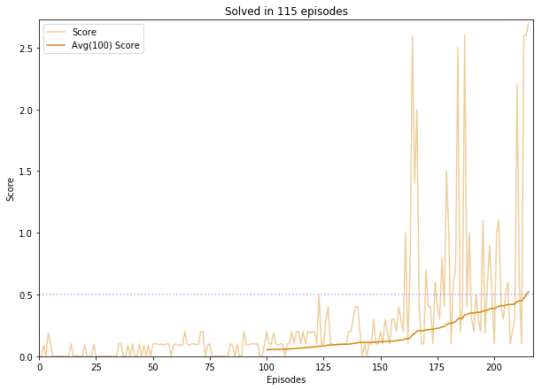
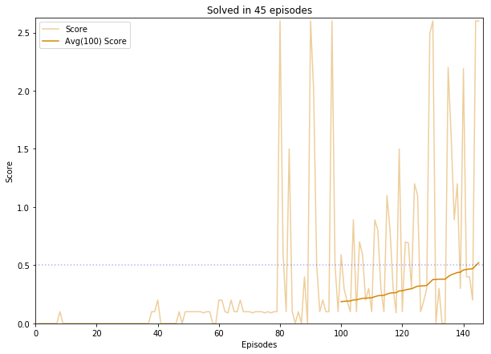

# Report Deep RL Project: Collaboration and Competition in Tennis environment

## 1. Learning algorithm

The learning algorithm used to solve the Tennis environment is **Deep Deterministic Policy Gradients (DDPG)** as described in the reference paper [Continuous control with deep reinforcement learning](https://arxiv.org/abs/1509.02971) (Lillicrap &Hunt, 2016). 

DDPG is an actor-critic, model-free algorithm based on the deterministic policy gradient that can operate over continuous action spaces, and robustly solve many simulated physics tasks.

The code to implement DDPG is based on the version used for the [Reacher environment](../p2_continuous-control) (2nd project of Udacity Deep Reinforcement Learning Nanodegree). 

The **Actor network**, which maps *state* to *action values*, has **2 hidden fully connected layers with 128 units each**, and a final ouput layer that yields 4 action values with *tanh* activation.
The **Critic network**, which approximates the value function Q, has also **2 hidden fully connected layers with 128 units each**. The state vector constitutes the input of the first layer, while actions are introduced in the 2nd hidden layer.
Both neural networks use the rectified non-linearity **Relu** for all hidden layers.

Two different configurations were tried in this project.

## 2. Configuration 1: independent agents

For this configuration, we use 2 completely independent DDPG agents to solve the environment. Each agent has its own actor, its own critic and its own replay buffer.
The environment could be solved in 1509 episodes.

We have plotted below the difference of the scores of the 2 agents to check if the agents learned at the same speed and got equally strong.  
We observe that at the end of the training, one of the agent gets a small but consistent advantage on the other.

And if we watch the 2 agents play, we notice they learned a different behaviour: both agents move a lot, but the red player is always at the net when the ball pass over the net towards it, whereas the blue agent is always on its baseline in equivalent conditions.

## 3. Configuration 2: distributed agents

For this configuration, the 2 agents share the networks (only one local actor, one target actor, one local critic, one target critic) and share the replay buffer as well. Actually, we use exactly the same architecture and code as in the project [Continuous control](../p2_continuous-control). We can do that here, because the referentials used by the agents to express their local observations are equivalent, and thus one agent can learn from its own experience, but also from the experience of its opponent.

Using the same hyperparameters as in configuration 1, the environment is solved in 1116 episodes.

If we watch the 2 agents play, we observe, as expected, that the 2 agents have the same behaviour:

### Influence of τ

It seems that the interpolation parameter τ used in the soft update (θ_target = τ*θ_local + (1 - τ)*θ_target) has a big impact on the solving speed.
In our tests, other hyperparameters being equal, the bigger τ is, the faster the training.

|||
|---|---|
|τ = 1e-3 : solved in 740 episodes|τ = 1e-2 : solved in 353 episodes|
|τ = 1e-1 : solved in 115 episodes|τ = 2e-1 : solved in 45 episodes|
|||

## 4. Ideas for future work
For this environment (Tennis), because the agents have identical role and rewards, there is no need to apply more sophisticated algorithm that can deal well with various type of agents (like MADDPG)

My plan is to try MADDPG in a more complex environment like Soccer.